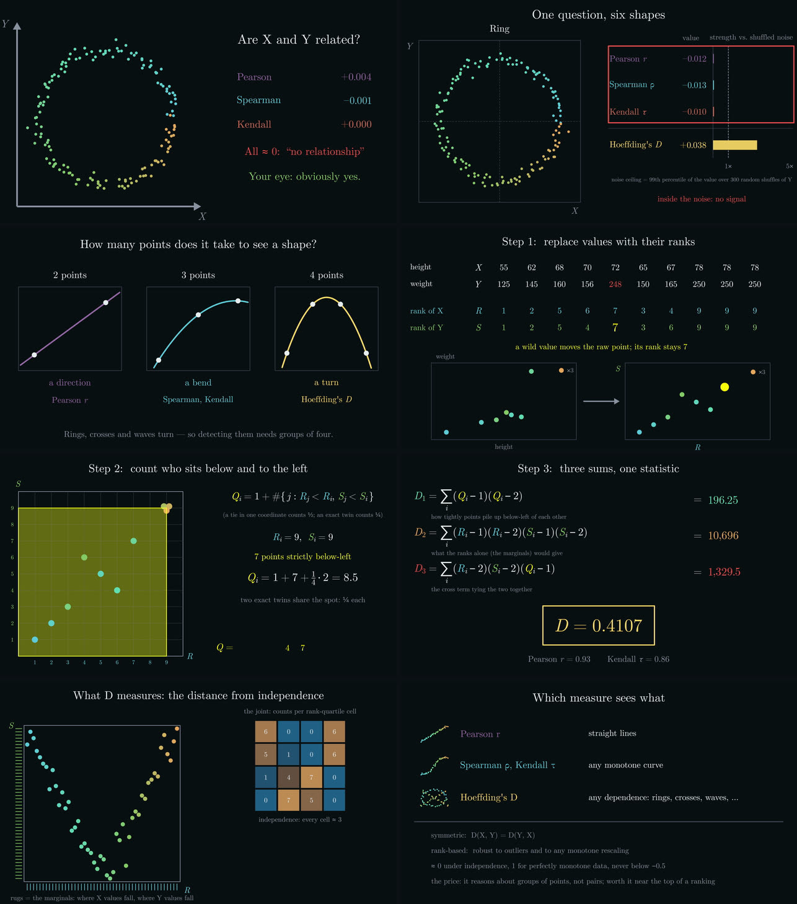
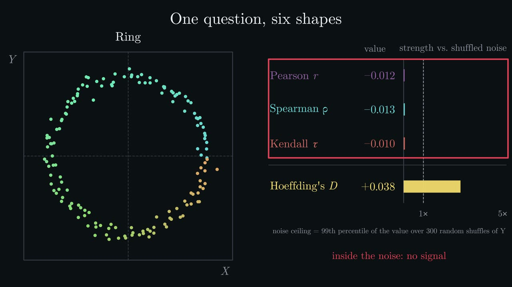

# Hoeffding's D: a franken_manim explainer

A 3Blue1Brown-style explainer of **Hoeffding's D**, about 7½ minutes long and narrated. It was written entirely against
[franken_manim](../franken_manim)'s native Rust front door, with no Python and no LaTeX.
The voice-over is spoken by [FrankenTTS](../frankentts) in the **robert** voice, and ffmpeg
is used only for the encode, the final join and loudness normalization.

**Final video:** `renders/final_4k_narrated/hoeffdings_d_explainer_4k.mp4`, at 3840×2160, 60 fps, H.264 High (NVENC p7, constant quality 16), with AAC narration normalized to −16 LUFS.
An earlier unnarrated 1080p cut is in `renders/final_1080p60/`.

## Chapters

| # | Chapter | What it shows | franken_manim features exercised |
|---|---|---|---|
| 1 | `01_hook` | A ring of 150 points, which Pearson, Spearman and Kendall all call "≈ 0", followed by the title card | `grow_arrow`, lagged `fade_in`, live `DecimalNumber` readouts, `show_passing_flash`, `indicate`, `write` |
| 2 | `02_gallery` | One cloud morphs through line, parabola, ring, X, wave and noise. Four measures update live, each judged against its own permutation-test noise ceiling | `Transform` of a 150-dot group, `always_redraw` bars, value-tracker tweens, `replacement_transform`, `SurroundingRectangle` |
| 3 | `03_quadruples` | 2 points show a direction, 3 a bend, 4 a turn; C(5000, 4) counts up | `FunctionGraph`, `grow_from_center`, `\binom` and `\frac` in native TeX, a comma-grouped counter |
| 4 | `04_ranks` | The article's worked example: heights and weights become ranks (ties average) in rank space, and an outlier doesn't matter | `transform_from_copy` cell-by-cell, tie highlighting, `.animate().move_to` |
| 5 | `05_counting` | Q_i as a lower-left quadrant count, compared with the independence baseline (R−1)(S−1)/(N−1) | `grow_from_point` quadrants, `Tex` with `t2c` by source identity |
| 6 | `06_formula` | D₁, D₂, D₃ counted up live, then Hoeffding's normalization, giving **D = 0.4107** | `TransformMatchingTex` over native span maps, live sums |
| 7 | `07_shuffle` | Shuffling Y keeps the marginals (rugs) and destroys the pairing. D is **recomputed from the moving dots every frame**, alongside a live 4×4 joint heat map; then a 2,000-shuffle permutation test | `always_redraw` closures that read live positions, `grow_from_edge` histogram |
| 8 | `08_outro` | A summary table, D's properties and credits | mini scatter glyphs, lagged reveals |

Every number on screen is computed by the scene. `stats.rs` is pinned at startup to the article's
worked example (R, S, Q, D₁ = 196.25, D₂ = 10696, D₃ = 1329.5, D = 0.410714…) and to scipy's
Pearson, Spearman and Kendall values. The data come from the engine's own seeded PCG64DXSM RNG.

## The video at a glance



One frame from each chapter, in order: the ring that fools all three correlations; the gallery's noise ceilings; why a turn needs more than pairs of points; ranks; the count Q; the three sums; the live shuffle test; and the summary.

## Why Hoeffding's D



Pearson's r measures how well a straight line fits. Spearman's ρ and Kendall's τ measure how consistently Y rises (or falls) as X rises. All three summarize a *trend*, so all three read about zero on data that is completely structured but has no trend: a ring, an X, a parabola, a wave. The video opens on exactly that case, 150 points on a circle where r = +0.004, ρ = −0.001 and τ = 0.000.

Hoeffding's D (Wassily Hoeffding, 1948) asks a different question: could X and Y be independent at all? In the population it measures

```math
\iint \big(F(x,y) - F_1(x)\,F_2(y)\big)^2 \, dF(x,y)
```

the squared gap between the joint distribution and the product of its marginals, weighted by where the data lies. For continuous distributions that gap is zero only under independence, so D responds to any form of dependence, not just to monotone trends.

| Property | What it means in practice | Pinned by the test |
|---|---|---|
| Uses only ranks | Unchanged by any strictly increasing transform of X or of Y, and by reflecting either axis. Units, skew and outliers don't matter; only the order does. | `d_is_invariant_under_strictly_monotone_and_reflecting_transforms` |
| Symmetric | D(X, Y) = D(Y, X), and the order of the (x, y) pairs is irrelevant. | `d_is_symmetric_and_ignores_the_order_of_the_pairs` |
| Monotone dependence scores 1 | Any perfectly increasing *or* decreasing relationship gives exactly 1. | `perfect_monotone_dependence_scores_exactly_one` |
| Centered at 0 under independence | D averages 0 when X and Y are independent; a single sample scatters around 0 and can be slightly negative. | `d_averages_to_zero_under_independence` |
| Bounded below | For tie-free data, D ≥ −½, and N = 5 reaches it. | `d_stays_within_the_narrated_range` |

What it costs:

- **N ≥ 5.** The statistic is built from groups of five points, so it is undefined for smaller samples.
- **Quadratic time as written.** Each Qᵢ scans every other point, so `stats::hoeffding` is O(N²). That is plenty for N = 150 and for the 2,000-shuffle test. O(N log N) algorithms exist for large N.
- **No direction.** D says *that* X and Y are dependent, not *how*. There is no sign to read as positive or negative association.
- **Less power on a plain linear trend.** For a straight line in Gaussian noise, Pearson's r is the more powerful test. D gives up some power on the one shape r was designed for, in exchange for seeing every other shape.
- **Heavy ties at small N.** The ½ and ¼ tie credits keep D sensible with a few ties; the worked example has three people tied at 78. But heavily tied, tiny samples leave the scale: x = y = (0, 0, 0, 1, 1) is perfectly dependent and gives D = −1.84. The video's data are tie-free apart from the worked example. [SAS's documentation](https://support.sas.com/documentation/cdl/en/procstat/68142/HTML/default/procstat_corr_details07.htm) gives the same caveat: with many ties in a small sample, D can fall below −½. Pinned by `heavy_ties_at_small_n_leave_the_scale`.

## The statistic, exactly as `stats.rs` computes it

For N pairs (xᵢ, yᵢ):

1. **Ranks.** Rᵢ is the rank of xᵢ among the x values, and Sᵢ the rank of yᵢ, both starting at 1. Tied values share the average of the places they span, so three people tied for places 8, 9 and 10 all get rank 9.
2. **The bivariate count Q.** For each point, count the points strictly below and to the left of it in rank space, plus one, with half credit for a tie in one coordinate and a quarter for an exact twin:

   ```math
   Q_i = 1 + \#\{j : R_j < R_i,\ S_j < S_i\} + \tfrac12\#\{j : R_j = R_i,\ S_j < S_i\} + \tfrac12\#\{j : R_j < R_i,\ S_j = S_i\} + \tfrac14\#\{j \ne i : R_j = R_i,\ S_j = S_i\}
   ```

   If X and Y were independent, a point at (Rᵢ, Sᵢ) would expect about (Rᵢ − 1)(Sᵢ − 1)/(N − 1) points below and to its left. Chapter 5 sets each observed count against that baseline.
3. **Three sums.**

   ```math
   D_1 = \sum_i (Q_i-1)(Q_i-2), \qquad D_2 = \sum_i (R_i-1)(R_i-2)(S_i-1)(S_i-2), \qquad D_3 = \sum_i (R_i-2)(S_i-2)(Q_i-1)
   ```

   D₁ measures how tightly the points pile up below and to the left of one another, D₂ depends only on the marginals, and D₃ is the cross term that ties the two together.
4. **Normalization.**

   ```math
   D = 30 \cdot \frac{(N-2)(N-3)\,D_1 + D_2 - 2(N-2)\,D_3}{N(N-1)(N-2)(N-3)(N-4)}
   ```

The article's worked example, which chapters 4–6 animate and `self_check` pins:

| | | | | | | | | | | |
|---|---|---|---|---|---|---|---|---|---|---|
| height x | 55 | 62 | 68 | 70 | 72 | 65 | 67 | 78 | 78 | 78 |
| weight y | 125 | 145 | 160 | 156 | 190 | 150 | 165 | 250 | 250 | 250 |
| R | 1 | 2 | 5 | 6 | 7 | 3 | 4 | 9 | 9 | 9 |
| S | 1 | 2 | 5 | 4 | 7 | 3 | 6 | 9 | 9 | 9 |
| Q | 1 | 2 | 4 | 4 | 7 | 3 | 4 | 8.5 | 8.5 | 8.5 |

D₁ = 196.25, D₂ = 10,696 and D₃ = 1,329.5. The numerator is 8·7·196.25 + 10,696 − 2·8·1,329.5 = 414, the denominator is 10·9·8·7·6 = 30,240, and D = 30 · 414 / 30,240 = 0.410714… For comparison, r = 0.9307, ρ = 0.9503 and τ-b = 0.8571.

**Where the formula comes from.** Hoeffding defined D as a U-statistic: the average, over every ordered choice of five distinct points, of the kernel

```math
\varphi = \tfrac14\,\psi(x_1,x_2,x_3)\,\psi(x_1,x_4,x_5)\,\psi(y_1,y_2,y_3)\,\psi(y_1,y_4,y_5), \qquad \psi(a,b,c) = \mathbf 1[b \le a] - \mathbf 1[c \le a]
```

Point 1 is an anchor, and each ψ asks whether one partner falls below the anchor while the other does not. Chapter 3's "groups of four" is the intuition behind this; the kernel adds the anchor, for five points in all. Listing every tuple is hopeless at any real N, and the rank formula above gets the same number from per-point counts in O(N²). Without ties the two agree exactly: `rank_formula_equals_hoeffdings_u_statistic_without_ties` checks the identity by brute force over all 5-tuples. The factor 30 is the scaling used by [SAS `PROC CORR`](https://support.sas.com/documentation/cdl/en/procstat/68142/HTML/default/procstat_corr_details07.htm) and by the article, and puts perfect monotone dependence at 1. Hoeffding's own statistic is D / 30.

## How the gallery compares four measures fairly

The four measures don't share a scale: |r| = 0.2 and D = 0.02 can be the same strength of evidence. So chapter 2 never compares raw values. Each bar is the measure divided by its own noise ceiling: the 99th percentile of |measure| over 300 shuffles of Y on the same cloud (`stats::null_q99`). Shuffling Y keeps both marginals exactly and destroys only the pairing, so the ceiling is what that measure reads on these very points when X and Y are independent by construction. A bar past the dashed line is beyond what 99% of shuffles produce, and bars saturate at five ceilings.

The values behind the bars, as `hoeffding stats` prints them (ceilings in parentheses):

| Shape | Pearson r | Spearman ρ | Kendall τ | Hoeffding's D |
|---|---|---|---|---|
| Line | **+0.991** (0.230) | **+0.991** (0.230) | **+0.920** (0.154) | **+0.8087** (0.0130) |
| Parabola | −0.014 (0.200) | −0.007 (0.187) | −0.014 (0.125) | **+0.1710** (0.0098) |
| Ring | −0.012 (0.226) | −0.013 (0.215) | −0.010 (0.153) | **+0.0375** (0.0131) |
| X (cross) | −0.003 (0.196) | −0.002 (0.197) | −0.006 (0.134) | **+0.0308** (0.0101) |
| Wave | −0.005 (0.211) | +0.000 (0.220) | −0.003 (0.147) | **+0.0274** (0.0137) |
| Pure noise | −0.017 (0.190) | −0.018 (0.180) | −0.014 (0.120) | −0.0029 (0.0112) |

Bold marks a value beyond its ceiling. D's ceilings sit near 0.01 because D concentrates tightly around zero under independence, which is exactly why raw values can't be compared across measures. On the parabola, D is 17 times its ceiling.

`the_gallery_narration_is_true_for_the_rendered_data` asserts what the narration says about each shape against these exact numbers: every measure clears its ceiling on the line, only D clears it on the parabola, ring, X and wave, and nothing clears it on pure noise.

Chapter 7 turns the same idea into a formal permutation test. After 2,000 shuffles of Y, none reaches the observed D.

## Narration: the picture follows the voice

- `src/narration.rs` holds the whole script: 61 lines, each keyed to the beat that triggers it.
- In a scene, `kit.say(stage, "g5")` first waits for the previous line to finish, then places the line's WAV at the current scene time through franken_manim's native, sample-exact mixer (`add_sound`, BN-14). `kit.hold(stage)` lets a line finish before the scene moves on.
- So animation timing adapts to the actual spoken lengths.
- Without `--narration`, the same scenes keep their visual-only pacing.

The background score (`sound.rs`) is a soft chord pad per chapter plus bell chimes on key reveals. It is synthesized in plain Rust and ducked under the voice.

```bash
./narrate.sh "$B" "$FTTS"             # ftts say --voice robert, one WAV per line (resumable)
python3 qa_narration.py "$B"          # franken_whisper transcribes every line and diffs it with the script
HOEFFDING_CUE_LOG=1 $B render ...     # logs each line's start time, for checking that picture and voice line up
```

The QA pass caught one line where "A cross" is acoustically "across"; the line was rewritten. All 61 lines now match the script.

## Build and render

```bash
# Uses ../franken_manim/crates/fmn (path dependency) and its pinned nightly.
RCH_SHIM_LOCAL_IDE=1 cargo build --release
B=$CARGO_TARGET_DIR/release/hoeffding       # or target/release/hoeffding

$B stats                                     # every number the video shows
$B script                                    # the narration as TSV
$B render all --res 960x540 --fps 30 --narration narration --out draft          # fast draft
$B render all --res 3840x2160 --fps 60 --crf 16 --preset slow \
              --narration narration --out renders/final_4k                      # delivery

cd renders/final_4k && ../../master.sh      # join chapters + two-pass loudnorm (video stream copied)
```

### Delivery quality

`fmn::render` sends libx264 no rate control (x264's CRF 23 default) and caps each ffmpeg job at
600 s (beads `fm-video-encode-quality-knob-fm85` and `fm-render-ffmpeg-job-limits-laeo`).

`src/encode.rs` therefore injects an `FfmpegCapability` whose process runner wraps the standard exact-image runner. It adds `-crf/-preset/-tune animation` to the libx264 job and `-b:a 256k` to the mux, and raises the timeout. Everything still runs through franken_manim's sandboxed boundary. The x264 SEI in the output confirms the settings.

On macOS, `render` also retries a chapter when the known transient Darwin `killpg` EPERM race fails it (bead `fm-darwin-killpg-eperm-race-7aae`). Publication is atomic, so nothing partial is left behind.

## How much you have to download

The whole video comes from one 9.2 MB binary. ffmpeg is the only other thing it needs, to write MP4. Making the same kind of video with legacy manim means installing a Python stack and a LaTeX distribution. These figures were measured on macOS arm64 in October 2026, and exclude the FrankenTTS narration.

| Stack | Download | Installed |
|---|---|---|
| **This explainer** (`hoeffding`, 9,242,880 B) + Homebrew ffmpeg | **58.1 MB** | **154.3 MB** |
| `fmn` CLI (13,030,096 B) + Homebrew ffmpeg | 61.9 MB | 158.1 MB |
| manim CE 0.21 + MacTeX 2026 (the docs' recommendation) | 7,001.8 MB | 10,875.4 MB |
| manim CE 0.21 + BasicTeX + manim's tlmgr extras (the smallest LaTeX that works) | 351.5 MB | 865.4 MB |
| manimgl 1.7.2 + MacTeX 2026 | 7,059.1 MB | 11,064.1 MB |
| manimgl 1.7.2 + BasicTeX + extras | 408.8 MB | 1,054.1 MB |
| Linux: manim CE + `texlive-full` via apt (the docs' Linux recommendation) | 4,679.3 MB | 9,472.4 MB |

- **Inside the binary.** `hoeffding` links only macOS system libraries: libSystem, libobjc, libiconv, and the IOKit, OpenDirectory, Foundation and CoreFoundation frameworks. Its TeX engine (fmd-math) and fonts (Computer Modern and IBM Plex Sans, about 3.7 MB) are compiled in.
- **Proof that nothing external is used.** I sandboxed the binary so it could not read MacTeX, Homebrew or any system font folder. It still typeset the formula chapter byte-identically, and with only ffmpeg allowed to run, it wrote a valid MP4.
- **Legacy manim rows** add up:
  - a uv-managed CPython 3.12 and the package's wheels;
  - Homebrew `cairo pkg-config`, plus `ffmpeg` for manimgl (CE bundles its own ffmpeg inside PyAV);
  - the LaTeX distribution: MacTeX at 6,865.0 MB download and 10,449.3 MB installed, according to the package's own install-size field.
- **Not counted.** pycairo compiles from source on macOS, so legacy manim also needs the Xcode Command Line Tools: 1,958.5 MB on this Mac, not counted above.

## The second front door

`portal/hoeffding_portal.py` holds two segments (the ring hook, and the live-D shuffle) written as plain `manimlib` scene code. They render through the separately installed `fmn-python` portal:

```bash
fmn-python portal/hoeffding_portal.py RingHook ShuffleLiveD --format mp4 \
    --resolution 1920x1080 --fps 60 --video_dir out.mp4
```

## Known engine limitations worked around

- `\rho` and `\theta` in math mode render as ϱ and ϑ (bead `fm-5wq.60`), so Spearman's ρ uses the text face's upright ρ.
- Native `Axes` cannot be repositioned with `c2p` following (bead `fm-native-axes-reposition-n1yd`), so the scenes use a small `Frame2` data-window helper (`kit.rs`).
- There is no 2D camera pan or zoom on the fast retained route, so the scenes have none.
- Frames render serially (bead `fm-sq8.5`), so a 4K render uses about 1–2 cores of 14. The final cut took roughly an hour.

## Architecture

```text
 stats.rs ───────────── numbers ───────────────┐
                                               ▼
 narration WAVs ── Narrator::say ──┐   chapters/*.rs: eight scenes built from
 sound.rs pad + chimes ────────────┤   mobjects, animations and live readouts
                                   ▼               │
                         Scene::add_sound          ▼
                                   └──── fmn Stage / Scene
                                               │
                                               ▼
                 fmn::render: rasterize every frame, mix the audio, and encode
                 with ffmpeg behind the sandboxed process boundary
                 (encode.rs adds CRF or NVENC CQ, preset, 256k AAC)
                                               │
                                               ▼
                             OUT/<chapter>.mp4, one per chapter
                                               │
                                  master.sh: join + loudness
                                               ▼
                              hoeffdings_d_explainer_4k.mp4
```

| Module | Responsibility |
|---|---|
| `src/main.rs` | The `hoeffding` CLI (`hoeffding help` lists every option). `render` builds each chapter as its own scene and MP4, which keeps every ffmpeg job short. It applies the quality options and retries a chapter after the transient Darwin EPERM race. |
| `src/chapters/` | The eight scenes, each a `SceneConstruct`, listed in `registry()`. `glyphs.rs` is a typesetting probe sheet, not a chapter. |
| `src/kit.rs` | The shared scene kit. It holds the palette and the text and TeX helpers, including the span maps `TransformMatchingTex` needs. The `live_number` and `live_bar` readouts are built on `always_redraw`. It also provides the `Frame2` data window, `play!` with the `Timed` trait for timing, and `fade_all`. |
| `src/stats.rs` | Ranks, Q, D₁–D₃ and D; Pearson, Spearman and Kendall τ-b. It also holds the seeded shape generator, the permutation-test noise ceilings and `self_check`. |
| `src/narration.rs` | The script, one `(id, text)` pair per line, and the `Narrator` that places each line's WAV on the timeline. |
| `src/sound.rs` | The score: a chord pad per chapter and bell chimes, synthesized as 48 kHz WAVs in plain Rust. |
| `src/encode.rs` | Delivery-quality ffmpeg arguments, injected by wrapping the `FfmpegCapability` process runner. |

**Live readouts.** Values that change during an animation are not keyframed. `always_redraw` closures rebuild each readout from the current state on every frame. Chapter 2's bars follow value trackers. Chapter 7 recomputes D, the 4×4 joint counts and the marginal rugs from the dots' current positions, so the number on screen is always the statistic of the picture on screen.

**Determinism.** All random data come from franken_manim's PCG64DXSM generator, which is bit-exact with NumPy's. Each gallery shape has its own seed (1000 plus the shape's index), and the noise ceilings use seed 99. So every render shows the same numbers, and `hoeffding stats` prints them.

## Design principles

1. **Numbers are computed, then pinned.** Every statistic on screen comes from `stats.rs` applied to the data the scene draws. `self_check` runs before every command. It stops the program before the first frame if the worked example drifts from the article (R, S, Q, D₁, D₂, D₃, D) or from scipy (r, ρ, τ). Chapter 6's TeX also has a few typed literals: N = 10, the substituted sums, and 414 / 30,240. `cargo test` checks those against the computation.
2. **The narration's claims are tests.** What the voice says about the data is asserted against the exact data the video renders. That includes "one for a perfectly monotone relationship", "never below minus one half", "for a straight line, everyone agrees" and "the correlations sit right inside the noise".
3. **The voice sets the pace.** Scenes are written as beats keyed to script lines, not as timelines in seconds, so re-recording a line re-times the picture. See [Narration](#narration-the-picture-follows-the-voice).
4. **One external tool, behind one boundary.** ffmpeg is the only subprocess. It runs only through franken_manim's sandboxed process boundary, with a cleared environment and limits on wall-clock time and output. Delivery quality comes from wrapping that boundary's runner, not from going around it.
5. **Engine gaps are worked around in the open.** Every limitation this project hit is filed upstream as a bead. Each one is listed under [Known engine limitations](#known-engine-limitations-worked-around), with the workaround used here.
6. **Chapters are independent.** Each chapter renders to its own MP4 from its own scene state. So chapters can be rendered in parallel (`render_parallel.sh`) or one at a time, then joined at the end.

## Tests

```bash
cargo test
```

The suite renders nothing, so it needs no ffmpeg, fonts or narration. It does compile the franken_manim crates, like any build.

| Module | Tests | What they pin |
|---|---|---|
| `stats` | 13 | The article's worked example and the fraction chapter 6 types (414 / 30,240). Equality with Hoeffding's brute-force U-statistic. Invariance under monotone transforms and reflections, symmetry, and pair order. D = 1 for monotone data. The [−½, 1] range for tie-free data, over every ordering of N = 5, 6 and 7, and how heavy ties break it. A zero mean under shuffling. The gallery narration on the rendered data. The counting and shuffling helpers. |
| `encode` | 7 | The ffmpeg argument contract: x264 gets CRF, preset and `-tune animation`. NVENC gets p7 constant quality and `-gpu`, never the x264 preset. Stream copies are untouched, the AAC bitrate is added once, and timeouts are only ever raised. |
| `main` | 5 | CLI parsing, including the exact invocation `render_parallel.sh` makes. A typo is an error, not a chapter name. |

Beyond `cargo test`, `self_check` guards every run, and the narration is checked by transcribing it against the script (see [Narration](#narration-the-picture-follows-the-voice)).

## Repository layout

```text
src/                 the renderer (see Architecture)
  chapters/          one file per chapter, plus glyphs.rs
narration_lab/       the voice-over pipeline (see Narration)
portal/              two segments as plain manimlib code for the fmn-python portal
perf/                profiler hotspot summaries from 4K renders, and attribute.py
docs/media/          README stills taken from the 4K cut
narrate.sh           the original one-take voice-over, one WAV per line
qa_narration.py      transcribe each line with franken_whisper and diff it with the script
master.sh            join the chapters and master the loudness
render_parallel.sh   one render process per chapter, optionally spread across GPUs
```

The repository holds no rendered video or audio, narration WAVs, or franken_whisper QA database. They are generated locally and gitignored, and at about 200 MB the 4K cut is over GitHub's 100 MB file limit.

## Building from a fresh clone

```bash
git clone https://github.com/Dicklesworthstone/franken_manim
git clone https://github.com/Dicklesworthstone/franken_manim_hoeffding_explainer
cd franken_manim_hoeffding_explainer
cargo test                    # rustup fetches the pinned nightly first
cargo build --release
target/release/hoeffding stats
target/release/hoeffding render 01_hook --res 960x540 --fps 30 --silent --out draft
```

- The two checkouts must sit side by side, and franken_manim's directory must be called `franken_manim`. `Cargo.toml` depends on `../franken_manim/crates/fmn` by path.
- `Cargo.lock` and the test suite were last verified against franken_manim [`7ef2eac2`](https://github.com/Dicklesworthstone/franken_manim/commit/7ef2eac21d4e). If franken_manim has moved on, check out that revision, or let `cargo build` (without `--locked`) re-resolve.
- `render` needs `ffmpeg` on `PATH`. `stats`, `script` and `cargo test` don't.
- A narrated render also needs the voice-over WAVs. They are generated, not committed; see [Narration](#narration-the-picture-follows-the-voice).
